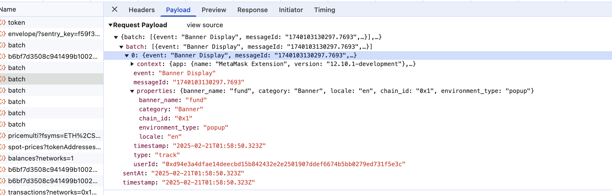

# Create Analytics Event

## Overview

This document outlines the process for creating a new analytics event in MetaMask (Extension and Mobile)

## Prerequisites

- Before you begin, please refer to this [Working with Event Metrics](https://www.notion.so/consensys/Working-with-Event-Metrics-3b0b5a4308e64649a54a2864886c0412) and make sure you understand the context of the analytics events.
- Users must opt into MetaMetrics for events to be tracked, this can be configured when onboarding and in settings `Privacy & Security` => `Participate in MetaMetrics`

## Creating a New Analytics Event

### 1. Define the Event Schema

First, create a schema for your event following the [Segment Schema guidelines](https://github.com/Consensys/segment-schema/blob/main/CONTRIBUTING.md). Your event should:

- Have a clear, descriptive name (e.g., `wallet_connected`)
- Include relevant properties and context
- Follow the naming conventions

### 2. Implement a New Event in the Extension

#### 2.1. Add the Event Name to the Segment Schema

Add your new event name as a string literal type to the `MetaMetricsEventName` enum in `shared/constants/metametrics.ts`.
And please check `MetaMetricsEventPayload` inside `shared/constants/metametrics.ts`for the details of the parameters.

#### 2.2. Implement the Event in the Extension

To implement an analytics event in the extension, you'll need to use the `MetaMetricsContext` and its `trackEvent` function. This context provides a standardized way to track events while handling opt-in status and data anonymization automatically. Below is an example showing how to implement event tracking in a React component:

```typescript
// 1. Import the required types and context
import { MetaMetricsContext } from '../../../shared/contexts/metametrics';
import {
  MetaMetricsEventName,
  MetaMetricsEventCategory,
  MetaMetricsEventFragment,
} from '../../../shared/constants/metametrics';

// 2. Use the context in your component
function YourComponent() {
  const { trackEvent } = useContext(MetaMetricsContext);

  const handleAction = () => {
    trackEvent({
      event: MetaMetricsEventName.YourNewEventName,
      category: MetaMetricsEventCategory.YourCategory,
      properties: {
        // Add properties that provide context about the event
        property_one: 'value_one',
        property_two: 'value_two',
      },
      sensitiveProperties: {
        // Add properties that might contain sensitive data
        // These will be automatically anonymized
        wallet_address: '0x...',
      },
    });
  };

  return <button onClick={handleAction}>Perform Action</button>;
}
```

#### 2.3 E2E Testing

For implementing analytics event mocks in E2E tests using `testSpecificMock`, please refer to recording in notion of [Extension Codebase - E2E tests (mocking)](https://www.notion.so/metamask-consensys/f649ecf027cc41db858d3a3574fe3a99?v=da4af5e48f0e44d7b4536c4e2e911f36).

Example E2E test implementation:

```typescript
// Mock the analytics endpoint
async function mockAnalyticsEndpoint(mockServer) {
  return await mockServer
    .forPost('https://api.segment.io/v1/batch')
    .withJsonBodyIncluding({
      batch: [
        {
          type: 'track',
          event: MetaMetricsEventName.YourNewEventName,
          properties: {
            property_one: 'value_one',
            property_two: 'value_two',
          },
        },
      ],
    })
    .thenCallback(() => ({ statusCode: 200 }));
}

describe('YourNewEventName Analytics', () => {
  it('tracks the event with properties', async () => {
    await withFixtures(
      {
        fixtures: new FixtureBuilder()
          .withMetaMetricsController({
            participateInMetaMetrics: true,
          })
          .build(),
        testSpecificMock: async (mockServer) => [
          await mockAnalyticsEndpoint(mockServer),
        ],
      },
      async ({ driver, mockedEndpoints }) => {
        // Test implementation
        const events = await getEventPayloads(driver, mockedEndpoints);
        assert.equal(events[0].properties.property_one, 'value_one');
        assert.equal(events[0].properties.property_two, 'value_two');
      },
    );
  });
});
```

#### 2.4. Validate the Event

To validate your analytics event implementation:

1. Run the extension locally in development mode
2. Open Chrome DevTools
3. Navigate to the Network tab
4. Perform the action that should trigger your analytics event
5. Look for a `batch` request in the Network tab
6. Inspect the request payload to verify:
   - The event name matches your implementation
   - All expected properties are present and correctly formatted
   - Property values are being captured as intended



#### 2.5. Opt-out Handling

The tracking system automatically respects user privacy settings:

- Events are only tracked if the user has opted into MetaMetrics
- Sensitive data is automatically anonymized
- You don't need to check opt-in status before calling trackEvent
