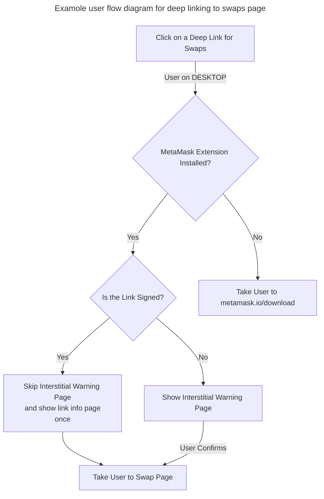
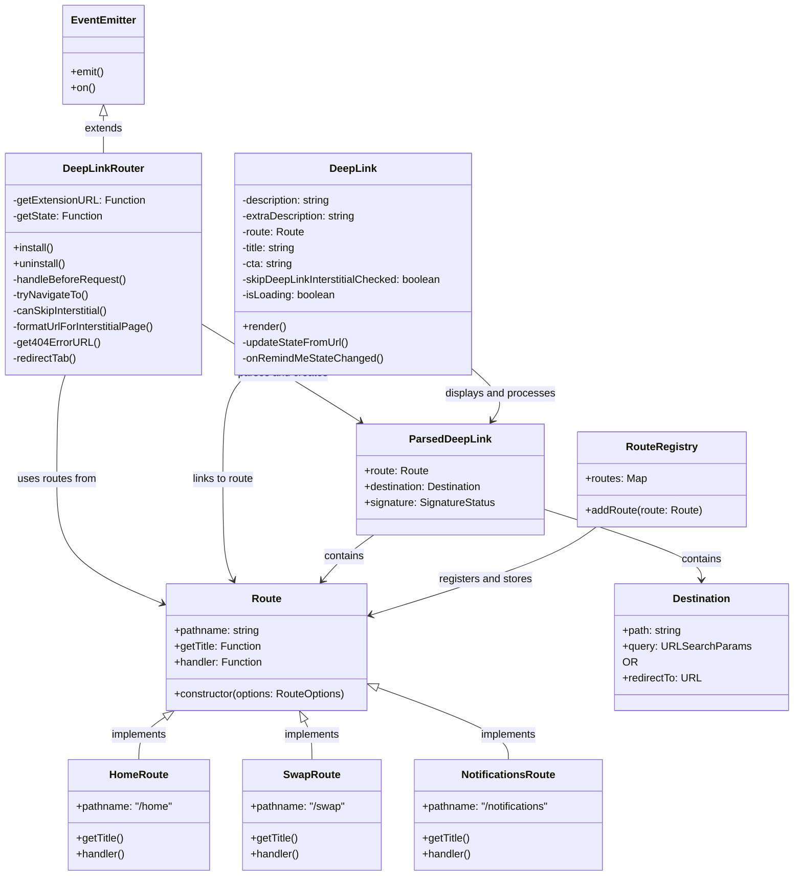

# Deep links

## Overview
MetaMask deep links are smart URLs that dynamically route users to the most relevant point in their journey—based 
on their device, app status, and the action we want them to take. 
Deep links help reduce friction, personalize the journey, and drive higher conversion. 
For a link to be a deeplink, it needs to have logic baked in.

### Example
For more clarity on how deep links work, here is an example of a deep link which links to a swaps feature MetaMask extension.
https://link.metamask.io/swap?sig=AWqgclBcX7wDKXJ-ZbABoRU2pzVS7xQAA5UsIuWEzKVchvqyYos_w0At4zR33_0wJdFAypIJM4VgboiU3ghhUQ

- Clicking on the deep link above would have the following behavior:
  - If a user is on DESKTOP:
    - And MetaMask extension is installed: 
      - It will take the user to the Swap page.
    - And MetaMask extension is not installed: 
      - It will take the user to the metamask.io/download website.

### Additional notes
- If a deep link is not registered in the extension, the error "Not found" page will be displayed.

### Deep link user flow



## Creating and signing deep links
There are several steps that need to be taken to register a deep link in the MetaMask extension.

#### 1. Construct a deep link and sign it.
For deep link construction we use `branch.io` features. 
Branch service is configured and automatically capable of linking any path to the extension route, if the route is registered.
So, adding `/home` or `/swap` at the end of `link.metamask.io` would be enough, and there is no need for additional configurations on the Branch side. 

Internal deep links are supposed to be signed and skip interstitial (warning page). 
Links are signed with a protected dedicated link signer, so additional access is required (ask internally for link signer application and access).

Example:
```text
https://link.metamask.io/home?sig=mmVgbZk8ucIY8-syEWrtnRvZlrHGQgM7Jl26fgRVjuwX62UVvhUE5nxOCWn0kEbYhZ_P17nwCZBbqJU7rPMx2w 
```

#### 2. Register deep link route in extension

Add a new file to the deep links route folder with a name of the route (e.g., home.ts) and create route definition.
```typescript
import { DEFAULT_ROUTE, Route } from './route';

export default new Route({
  pathname: '/home',
  getTitle: (_: URLSearchParams) => 'deepLink_theHomePage',
  handler: function handler(_: URLSearchParams) {
    return { path: DEFAULT_ROUTE, query: new URLSearchParams() };
  },
});

```
Directory location: https://github.com/MetaMask/metamask-extension/tree/main/shared/lib/deep-links/routes

Add new route by calling `addRoute` utility function in index.ts file of the deep links route folder.
```typescript
import home from './home';

addRoute(home);
```

#### Additional notes
- Deep link route definition consists of:
  - `pathname` - Route path identifier (e.g., `/home`, `/swaps`, `/notifications`)
  - `getTitle` - Callback function that should return title of the deep link page. This is usually represented by the translation constant (e.g., `deepLink_theHomePage`).
  - `handler` - Callback function that should return an object with `path` and `query` properties.
    - `path` - Exact path of the route used in extension. Taken from the existing routes definitions (e.g., `DEFAULT_ROUTE`, `NOTIFICATIONS_ROUTE`).
    - `query` - URL query params. Constructed using `URLSearchParams` constructor function.
- Make sure that the route exists and return it from a handler under `path` key.
- Handler function can transform query parameters if necessary.
- For a deeper understanding of the route definitions and their properties, [check router implementation and its types](https://github.com/MetaMask/metamask-extension/blob/main/shared/lib/deep-links/routes/route.ts#L18).

## Architecture
For a deeper understanding of the deep links implementation and its architecture, here is the abstracted class diagram 
that shows associations and responsibilities of the particular components in the system.



Deep Link Router is instantiated in service worker ([background.js](https://github.com/MetaMask/metamask-extension/blob/main/app/scripts/background.js#L757)). 

## Security
Internal deep links are supposed to be signed and signed links will skip interstitial (warning page).
By signing links, it is ensured that there is a distinction between what MetaMask provides and what is coming from a community outside.
