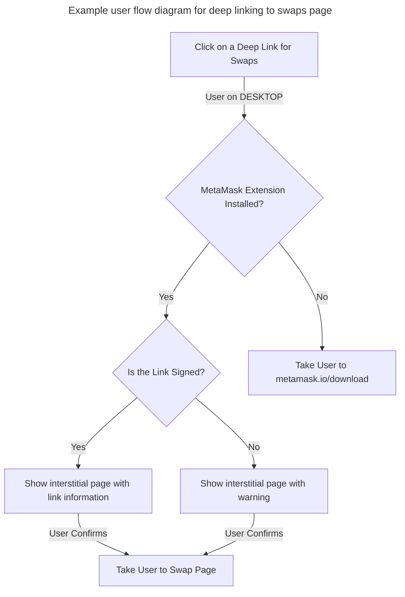

# Deep links

## Overview

MetaMask deep links are smart URLs that dynamically route users to the most relevant point in their journey—based
on their device, app status, and the action we want them to take.
Deep links help reduce friction, personalize the journey, and drive higher conversion.
For a link to be a deeplink, it needs to have logic baked in.

### Example

For more clarity on how deep links work, here is an example of a deep link which links to a swaps feature MetaMask extension.
https://link.metamask.io/swap?sig=AWqgclBcX7wDKXJ-ZbABoRU2pzVS7xQAA5UsIuWEzKVchvqyYos_w0At4zR33_0wJdFAypIJM4VgboiU3ghhUQ

- Clicking on the deep link above would have the following behavior:
  - If a user is on DESKTOP:
    - And MetaMask extension is installed:
      - It will take the user to the Swap page.
    - And MetaMask extension is not installed:
      - It will take the user to the metamask.io/download website.

### Additional notes

- If a deep link is not registered in the extension, the error "Not found" page will be displayed.

### Deep link user flow



## Creating and signing deep links

There are several steps that need to be taken to register a deep link in the MetaMask extension.

#### 1. Construct a deep link and sign it.

For deep link construction we use `branch.io` features.
Branch service is configured and automatically capable of linking to any path registered within the extension as a deep link route.
So, adding `/home` or `/swap` at the end of `link.metamask.io` would be enough, and there is no need for additional configurations on the Branch side.

Signed deep links will skip the interstitial warning page and show the link information interstitial instead.
For more information, please refer to the [ADR](https://github.com/MetaMask/decisions/blob/dcb42a5395507928e87c183dd1809c83d9cb408d/decisions/core/0007-deep-linking-into-wallet.md).

Links are signed with a protected dedicated link signer, so additional access is required (ask internally for link signer application and access).

Example:

```text
https://link.metamask.io/home?sig=mmVgbZk8ucIY8-syEWrtnRvZlrHGQgM7Jl26fgRVjuwX62UVvhUE5nxOCWn0kEbYhZ_P17nwCZBbqJU7rPMx2w
```

#### 2. Register deep link route in extension

Add a new file to the deep links route folder with a name of the route (e.g., home.ts) and create route definition.

```typescript
import { DEFAULT_ROUTE, Route } from './route';

export default new Route({
  pathname: '/home',
  getTitle: (_: URLSearchParams) => 'deepLink_theHomePage', // deepLink_theHomePage is a translation constant from messages.json
  handler: function handler(_: URLSearchParams) {
    return { path: DEFAULT_ROUTE, query: new URLSearchParams() };
  },
});
```

Directory location: https://github.com/MetaMask/metamask-extension/tree/main/shared/lib/deep-links/routes

Add new route by calling `addRoute` utility function in index.ts file of the deep links route folder.

```typescript
import home from './home';

addRoute(home);
```

#### Additional notes

- Deep link route definition consists of:
  - `pathname` - Route path identifier (e.g., `/home`, `/swaps`, `/notifications`)
  - `getTitle` - Callback function that should return title of the deep link page. This is represented by the translation constant (e.g., `deepLink_theHomePage` from `messages.json`).
  - `handler` - Callback function that should return an object with `path` and `query` properties.
    - `path` - Exact path of the route used in extension. Taken from the existing routes definitions (e.g., `DEFAULT_ROUTE`, `NOTIFICATIONS_ROUTE`).
    - `query` - URL query params. Constructed using `URLSearchParams` constructor function.
- Make sure that the route exists and return it from a handler under `path` key.
- Handler function can transform query parameters if necessary.
  - Handler function must be synchronous.
  - Handler function must not change anything. Deep links are read-only, and all actions/changes must be confirmed by the user in the UI layer.
- For a deeper understanding of the route definitions and their properties, [check router implementation and its types](https://github.com/MetaMask/metamask-extension/blob/main/shared/lib/deep-links/routes/route.ts#L18).
- For a link to work as a deferred deep link, it needs to be added to the branch.io _LinkHub_. For more information check [deferred deep links section below](#deferred-deep-links).

## Architecture

For a deeper understanding of the deep links implementation and its architecture, here is the abstracted class diagram
that shows associations and responsibilities of the particular components in the system.


Deep Link Router is instantiated in the background script ([background.js](https://github.com/MetaMask/metamask-extension/blob/main/app/scripts/background.js#L757)).

### Deferred deep links

Deferred deep links are used to navigate a user to a deep link route after the extension is installed. 
For deferred deep link to work, it is required to add the specific link with its path to the branch.io _LinkHub_.

The extension receives deferred deep link data from the MetaMask website, which collects that data via the integrated Branch.io SDK.

Deferred deep link flow:
1. When a user lands on the MetaMask website download page, the website stores the deferred deep link inside cookie.
2. When the user installs MetaMask extension, the extension reads and stores the cookie from the MetaMask website.
3. Then extension navigates the user to the deferred deep link after successful onboarding.

Notes:
- Deferred deep link is stored in the extension's local storage immediately after installation.
- User is navigated to the deferred deep link only if they completed the onboarding process within the two hours after installation.

## Security

It is recommended that deep links provided by MetaMask are signed.
Signed links will skip the interstitial warning page and show the link information interstitial instead.
Link information interstitial can be skipped next time if a user checks the "Don't remind me again" option.
By signing links, it is ensured that there is a distinction between what MetaMask provides and what is coming from a community outside.
