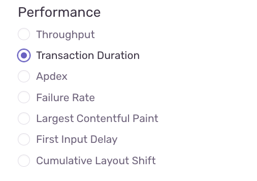
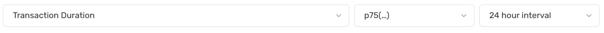
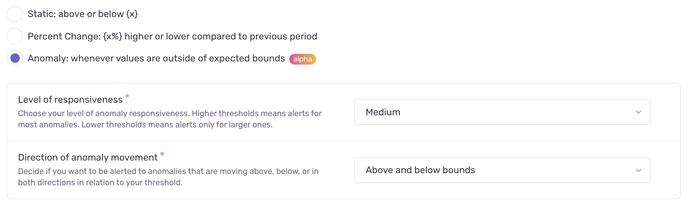
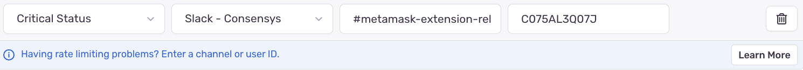
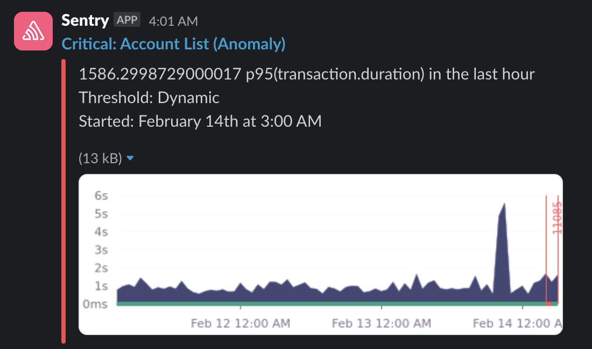

# Performance Alert

## Overview

Performance alerts can be created in Sentry to get notified in case a given performance metric regresses over time.

## Choose the trace you want to monitor

The performance metric needed to monitor the performance of a given user flow can be tracked by adding a performance trace to the codebase (or by using an existing trace if one already exists). More details on performance tracing can be found [here](./performance-tracing.md).

## Create a new alert

Go to [Sentry alerts page](https://metamask.sentry.io/alerts/rules/).

Click on "Create Alert".

Select the `Performance > Transaction duration` as alert type.



Click on "Set Conditions".

### 1. Define your metric

Leave this section unchanged, except the `p95` that you can change into `p75`.



### 2. Filter events

Indicate the name of the project:

- Choose `metamask` project for Extension
- Choose `metamask-mobile` project for Mobile

Indicate the name of the environment: `production`.

For Extension, use the following query format:

```
transaction:"name-of-the-trace"
```

For Mobile, if you want to filter for iOS metrics only, use the following query format:

```
transaction:"name-of-the-trace" release.package:io.metamask.MetaMask
```

For Mobile, if you want to filter for Android metrics only, use the following query format:

```
transaction:"name-of-the-trace" release.package:io.metamask
```

Example filter:

```
transaction:"UI Startup" release.package:io.metamask.MetaMask
```

### 3. Set thresholds

Select the following options:

- Type: `Anomaly`
- Level of responsiveness `Medium`
- Direction of anomaly movement: `Above bounds only`



### 4. Set actions

Click on "Add Action".

Select the following options:

- Action type: `Critical Status`
- Channel type: `Slack - Consensys`
- Slack channel name: `#your-slack-channel-name` (Example: #metamask-your-team-name-release-monitoring)
- Slack channel ID: `your-slack-channel-id` (Example: C085BL3Z04J)



PS: We recommend that you create a Slack channel called #metamask-your-team-name-release-monitoring, specifically for these Sentry alerts.
PSS: Here's an [article](https://zeroheight.com/help/article/retrieving-a-slack-channel-id-from-slack/) explaining how to retrieve the ID of a Slack channel.

### 5. Establish ownership

Choose a self explanatory name for your alert, like: `Anomaly - name-of-the-trace (type-of-application)`.

Example: `Anomaly - UI Startup (iOS)` or `Anomaly - UI Startup (Android)`

Select `#metamask`.

Click on "Save Rule".

That's it. Your performance alert is now configured and will post messages to the Slack channel you chose.


