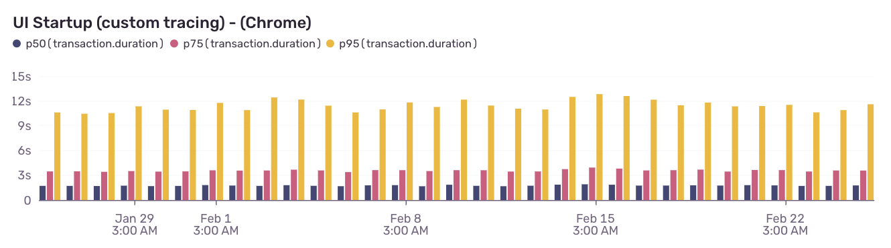
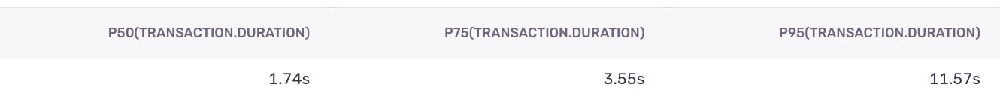
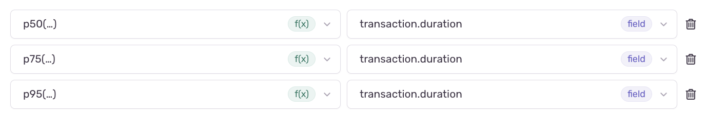

# Performance Dashboard

## Overview

Performance dashboards can be created in Sentry to visualise the evolution of a given performance metric over time.

## Choose the trace you want to monitor

The performance metric needed to monitor the performance of a given user flow can be tracked by adding a performance trace to the codebase (or by using an existing trace if one already exists). More details on performance tracing can be found [here](./performance-tracing.md).

## Choose the dashboard you want to use

Go to [Sentry dashboards page](https://metamask.sentry.io/dashboards/).

From there, you can either create a new dashboard for your team, or update an existing one.

If you create a new dasboard, you'll need to indicate the name of the project:
- Choose `metamask` project for Extension
- Choose `metamask-mobile` project for Mobile

Example:
- [Extension Platform team dashboard](https://metamask.sentry.io/dashboard/115782/)
- [Mobile Platform team dashboard](https://metamask.sentry.io/dashboard/115346/)

## Create a new widget

Click on "Add widget".

### 1. Name your widget

Choose a self explanatory name for your widget, like: `name-of-the-trace (type-of-application)`.

Example: `UI Startup (Chrome)` or `UI Startup (Firefox)` or `UI Startup (iOS)` or `UI Startup (Android)`

### 2. Choose your visualization

Choose `Bar Chart` if you're interested in the evolution of your metric over time:



Choose `Table` if you're interested in the average value for you metric:



### 3. Choose your dataset

Select `Transactions`.

### 4. Choose what to plot in the y-axis

Replicate the following config:



### 5. Filter your results

For Extension, if you want to filter for Chrome metrics only, use the following query format:
```
transaction:"name-of-the-trace" browser.name:Chrome
```

For Extension, if you want to filter for Firefox metrics only, use the following query format:
```
transaction:"name-of-the-trace" browser.name:Firefox
```

For Mobile, if you want to filter for iOS metrics only, use the following query format:
```
transaction:"name-of-the-trace" release.package:io.metamask.MetaMask
```

For Mobile, if you want to filter for Android metrics only, use the following query format:
```
transaction:"name-of-the-trace" release.package:io.metamask
```

Example filter:
```
transaction:"UI Startup" browser.name:Chrome
```

### 6. Group your results

Leave this section empty, and click on "Update Widget".

That's it. Your performance metric is now added to your dashboard.